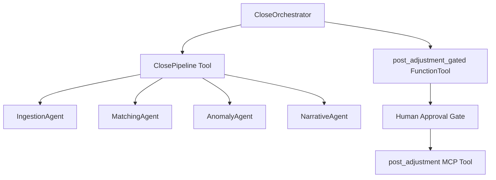

# Reconcile — Autonomous Month-End Close System

Reconcile is an agentic AI-driven system designed to automate the month-end close process with built-in human-in-the-loop (HITL) safety gates, separation of privilege, and multi-agent collaboration.

## Architecture & Data Flow

Reconcile leverages the Google Agentic Design Kit (ADK) and Model Context Protocol (MCP) to separate reasoning agents from the raw financial data store:



1. **CloseOrchestrator (Root)**: Coordinates the sequential workflow and acts as the gatekeeper.
2. **IngestionAgent**: Pulls and normalizes raw financial data (GL, bank statements, invoices).
3. **MatchingAgent & AnomalyAgent**: Run concurrently in a parallel block to perform 3-way reconciliation and surface discrepancies.
4. **NarrativeAgent**: Generates the final audit summary log.

---

## Tool Specifications

The system connects to the underlying financial data through a set of canonical MCP tools:

### Read Tools
- `get_ledger_entries(period: str) -> list[dict]`
- `fetch_bank_statement(period: str) -> list[dict]`
- `fetch_invoices(period: str) -> list[dict]`
- `lookup_vendor(name: str) -> dict`

### Write & Flag Tools
- `flag_transaction(txn_id: str, reason: str, actor: str) -> dict`
- `write_audit_log(actor: str, action: str, detail: str) -> dict`

### Gated Write (Money-Moving) Tool
- `post_adjustment(entry_txn_id: str, amount_cents: int, reason: str) -> dict`
  *Note: To align with safety invariants, this tool is wrapped by `post_adjustment_gated` on the orchestrator, ensuring no adjustments are posted without explicit human approval.*

---

## Running the System

### 1. Prerequisite: Generate the Database
Reconcile uses a deterministic, reproducible SQLite database seed:
```bash
python data/generate.py
```

### 2. Run the Close Driver
Start the end-to-end close pipeline with interactive human approvals:
```bash
python -m eval.run_close
```

## Security & Safety Invariants
- **Integer Cents**: All monetary values are represented as integers (`amount_cents`).
- **Least-Privilege Scoping**: Only the `CloseOrchestrator` has access to the gated `post_adjustment_gated` tool. All other write calls from sub-agents are blocked by the default-deny guardrail.
- **PII Masking**: Sensitive fields are automatically redacted before logging to the audit trail.
